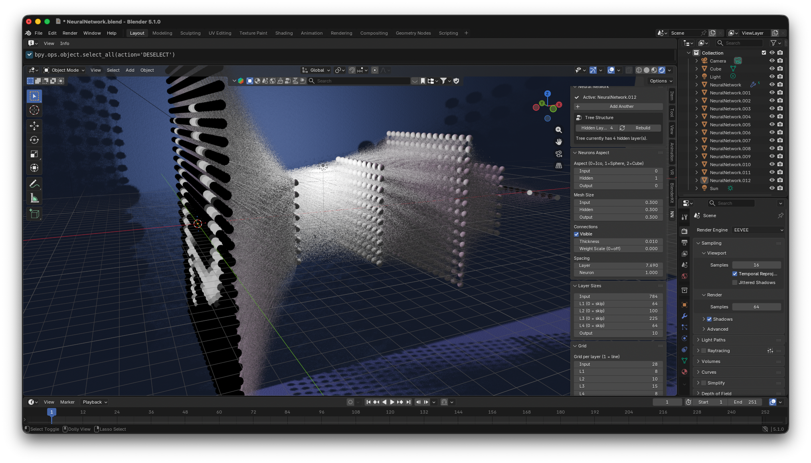
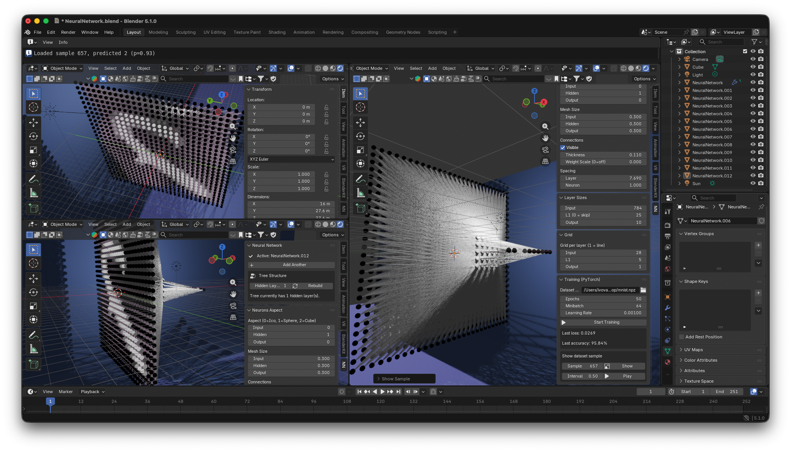
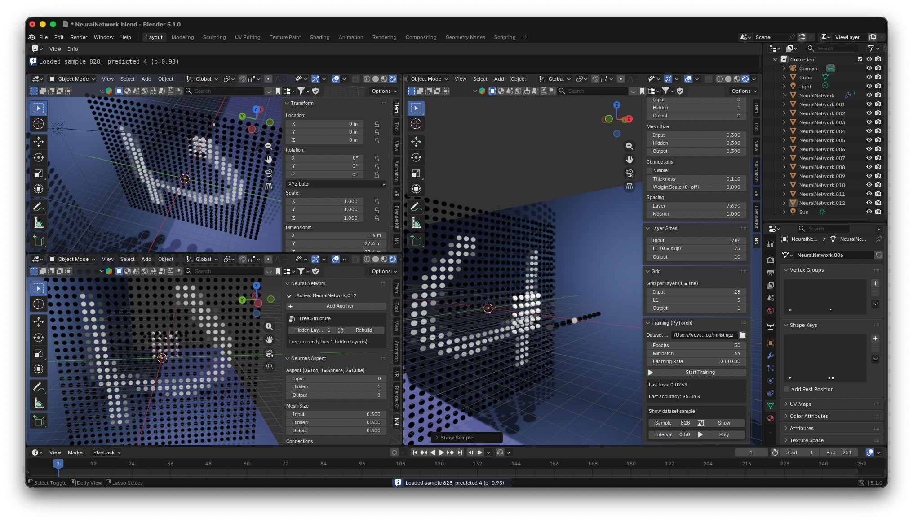
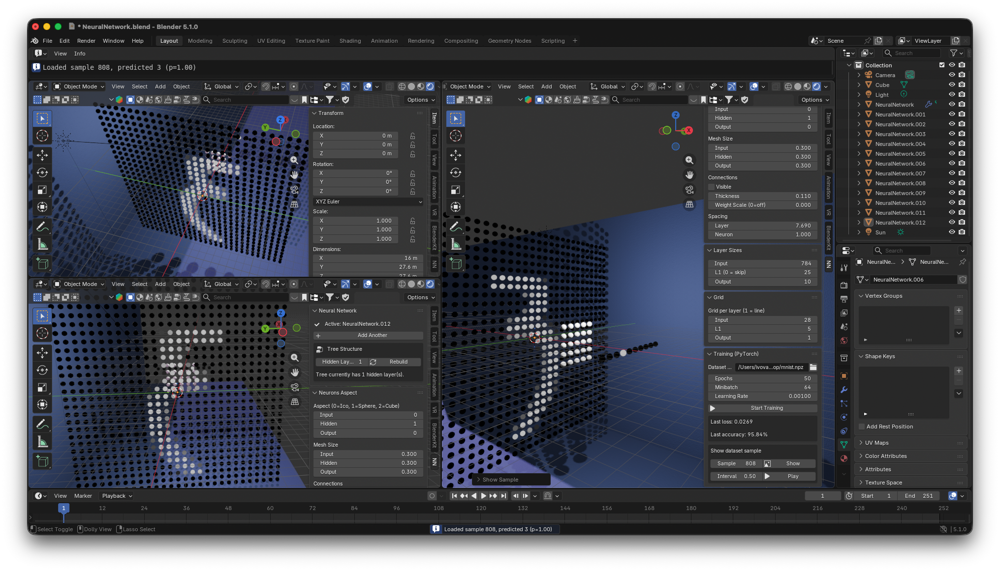
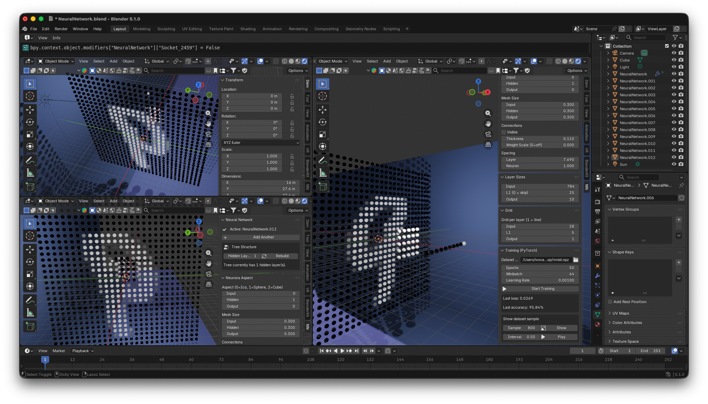

# Blender Neural Network

Create and train artificial neural networks inside Blender, visualized as 3D geometry.


Targeting **Blender 5.1+** with **Geometry Nodes** and **PyTorch**. The 2021 version that used Animation Nodes + TensorFlow is still in the git history; this one is a clean-sheet rewrite.

---

## Quick start: train on MNIST in 5 minutes

This walks you from a fresh checkout to watching your network classify handwritten digits live in the viewport. No prior Blender or PyTorch experience needed.

### A. Find Blender's Python

The addon trains with PyTorch, which has to live in **Blender's bundled Python** (not your system Python). To find its path, open Blender, switch to the **Python Console** panel, and run:

```python
>>> import sys; print(sys.executable)
```

It prints your Blender Python path. For example, on macOS:

```
/Applications/Blender.app/Contents/Resources/5.1/python/bin/python3.13
```

In every command below, replace `<blender python>` with the path you got. Keep the quotes — paths often contain spaces.

### B. Install dependencies

```bash
"<blender python>" -m pip install --upgrade pip
"<blender python>" -m pip install -r requirements.txt
```

This installs `torch`, `torchvision`, `numpy`, and `certifi` (~300 MB, CPU-only).

### C. Download MNIST

Run this from your normal terminal (not inside Blender), in the repo root:

```bash
"<blender python>" scripts/prepare_mnist.py
```

You're invoking **Blender's bundled Python interpreter** as a regular command-line program — Blender itself doesn't need to be open. We use *that* Python (instead of your system Python) only because it's where we just installed `torch` and `torchvision` in step B.

With the path substituted, on macOS that becomes, for example:

```bash
"/Applications/Blender.app/Contents/Resources/5.1/python/bin/python3.13" scripts/prepare_mnist.py
```

This downloads the 70k handwritten-digit dataset and writes [datasets/mnist.npz](datasets/) in the format the addon expects. Takes ~30 seconds.

### D. Install the addon

Zip the [neural_network/](neural_network/) folder. Then in Blender: **Edit → Preferences → Add-ons → Install** → pick the zip → enable **"Artificial Neural Network"**.

The addon builds its Geometry Nodes tree from Python on first use — no separate build step needed.

### E. Add the network and configure it for MNIST

1. **3D Viewport → Add → Neural Network.** A 3D network appears (the node group is built on first add — takes a moment).
2. Press **N** to open the sidebar; click the **NN** tab.
3. In **Tree Structure**, set **Hidden Layers = 1** and click **Rebuild**. The tree now has three layers: `Input`, `L1`, `Output`.
4. In **Layer Sizes**, set:
   - **Input Size**: `784`  *(28 × 28 pixels)*
   - **L1 Size** (the hidden layer): `100`
   - **Output Size**: `10`  *(digits 0–9)*
5. In **Grid**, set **Input Grid = 28**. The input layer rearranges into a 28×28 square — that's the digit canvas.

### F. Train

Open the **Training (PyTorch)** panel:

- **Dataset Path**: point at `datasets/mnist.npz`
- **Epochs**: `5`
- **Minibatch**: `64`
- **Learning Rate**: `0.001`

Click **Start Training**. The Blender UI stays responsive — each epoch takes ~10–30 s on CPU. After 5 epochs you should see **~95% accuracy**.

### G. Watch it predict

Once training finishes:

- In the Training panel, scroll to **Show dataset sample**. Type a sample index (0–69999) and click **Show** — the input layer lights up with that digit, and the output layer shows the network's prediction (the brightest output neuron is the predicted class).
- Click **Play** to cycle through samples automatically. Use **Interval** to pace it.

That's the full loop: build → train → predict, all visible in 3D. From here, try more hidden layers, bigger hidden sizes, longer training, or your own dataset.

---

## What it does

- Renders a feed-forward neural network as 3D geometry: neurons as instanced meshes, layers spaced along the X axis, connections as curves between adjacent layers.
- Every visual parameter (neuron count per layer, grid width, mesh type, mesh size, connection radius, spacing) is live-editable from a sidebar panel and drives a Geometry Nodes modifier.
- Trains the network on a user-supplied dataset using PyTorch, in a modal timer so the Blender UI stays responsive.
- After training, lets you scrub through dataset samples and see predictions painted onto the network.

## Gallery



This version lets you add hidden layers dynamically — pick any count in the *Tree Structure* panel and hit **Rebuild Tree**; the node group is regenerated on the fly.

| | |
|---|---|
|  |  |
|  |  |

## Sidebar panels

In the 3D viewport sidebar (`N`), the **NN** tab has:

- **Neural Network** — main panel; rebuild the tree with a custom hidden-layer count.
- **Neurons Aspect** — mesh type (0=Ico, 1=Sphere, 2=Cube), mesh size, connection visibility/radius, layer + neuron spacing.
- **Layer Sizes** — neuron count per layer (`Input`, `L1`, `L2`…, `Output`). Set a hidden layer to 0 to skip it.
- **Grid** — how many columns to lay each layer into. Use 1 for a line; `sqrt(N)` for a square (28 for MNIST).
- **Training (PyTorch)** — dataset path, epochs, minibatch, learning rate, **Start**. Once trained: **Show / Play** dataset samples through the network.

## Bring your own dataset

Point the Training panel at any of these formats:

- **`.npz`** with arrays `X` (shape `[N, features]`, float) and `y` (shape `[N]`, int labels).
- **`.csv`** with features in columns and the class label in the last column.
- **`.pt`** containing either `{"X": ..., "y": ...}` or a `(X, y)` tuple.

Rules:
- Number of features must equal **Input Size**.
- Number of classes must be ≤ **Output Size**.
- The loader auto-splits 80% train / 20% validation.

Smaller examples to play with:
- Input 3, L1 4, Output 2 — toy classifier.
- Input 784, L1 100, Output 10, Input Grid 28 — MNIST (the Quick Start above).

## Repository layout

```
neural_network/          Addon package
  __init__.py            Registers the addon
  panel.py               Sidebar panels
  operators.py           Bootstrap operator (Add > Neural Network)
  training_operator.py   Modal training operator + sample player
  nn_training.py         PyTorch backend (model + trainer + dataset loader)
  tree_builder.py        Geometry Nodes tree generator (built on demand)
scripts/
  prepare_mnist.py       Downloads MNIST → datasets/mnist.npz
tests/
  validate_tree.py       Asserts node-group interface (Blender --background)
  test_training.py       PyTorch backend tests (plain Python)
  test_bootstrap.py      Addon integration test (Blender --background)
docs/
  gn_tree_spec.md        Geometry Nodes tree specification
```

## Testing

Plain Python (needs `torch` + `numpy` installed):

```bash
python -m pytest tests/test_training.py
```

Inside Blender:

```bash
blender --background --python tests/validate_tree.py
blender --background --python tests/test_bootstrap.py
```

## Status & roadmap

This is the 1.0 Blender 5.1 rewrite. Known limitations:

- Text-neuron aspect (old addon's option 2) is dropped; aspect 2 is now Cube.
- Live activation visualization *during* training (color neurons by forward-pass magnitudes as each batch runs) is a planned stretch goal, not shipped. Post-training sample playback (Show / Play) does work today — input neurons light up with the digit and output neurons show the predicted class.
- Performance with very large layers: the all-pairs connection generator scales as M × N per layer pair, so dense networks (e.g. 784 → 1024 → 1024) produce a lot of curve geometry. For MNIST-scale (784 → 100 → 10) it's fine on a laptop.

Contributions welcome.
